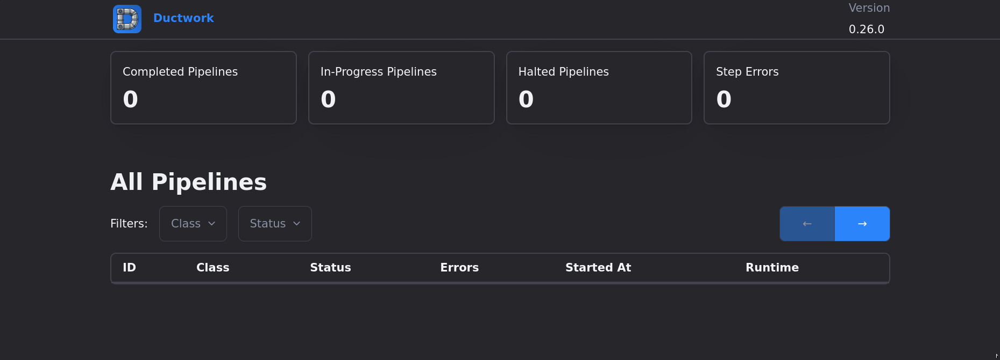

import { Aside } from '@astrojs/starlight/components';

`ductwork` ships with a web dashboard that lets you inspect your pipelines, steps, jobs, and processes from the browser.



## Mounting

The dashboard is a mountable Rails engine. If you ran the [rails generator](/docs/getting-started/installation/), it has already added the mount point to your `config/routes.rb` for you:

```ruby
# config/routes.rb
mount Ductwork::Engine, at: "/ductwork"
```

If you need to mount it manually, or want to serve it from a different path, just adjust the `at:` option:

```ruby
# config/routes.rb
mount Ductwork::Engine, at: "/admin/ductwork"
```

## Authentication

The dashboard exposes details about your pipelines and the data flowing through them, so you should not leave it open to the public. We strongly recommend wrapping the mount point in some form of authentication.

For example, with HTTP basic auth:

```ruby
# config/routes.rb
authenticate :user, ->(user) { user.admin? } do
  mount Ductwork::Engine, at: "/ductwork"
end
```

If you use Devise, the `authenticate` route helper shown above restricts the engine to signed-in admins. Any constraint or authentication scheme that works with a mounted engine will work here — the important thing is that the dashboard is not reachable by unauthenticated visitors.

## Read-Only

<Aside type="note">The current web dashboard is read-only.</Aside>

Today the dashboard is purely for observability — there is no way to mutate real data from the UI. You cannot pause pipelines, resume pipelines, revive pipelines, or otherwise act on your data through the dashboard. It is safe to share with anyone who needs visibility into your pipelines without the risk of them changing anything.
